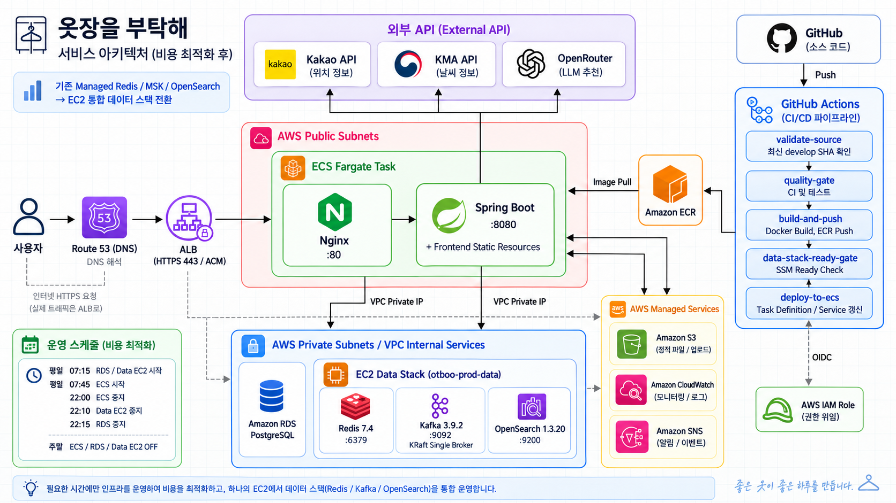
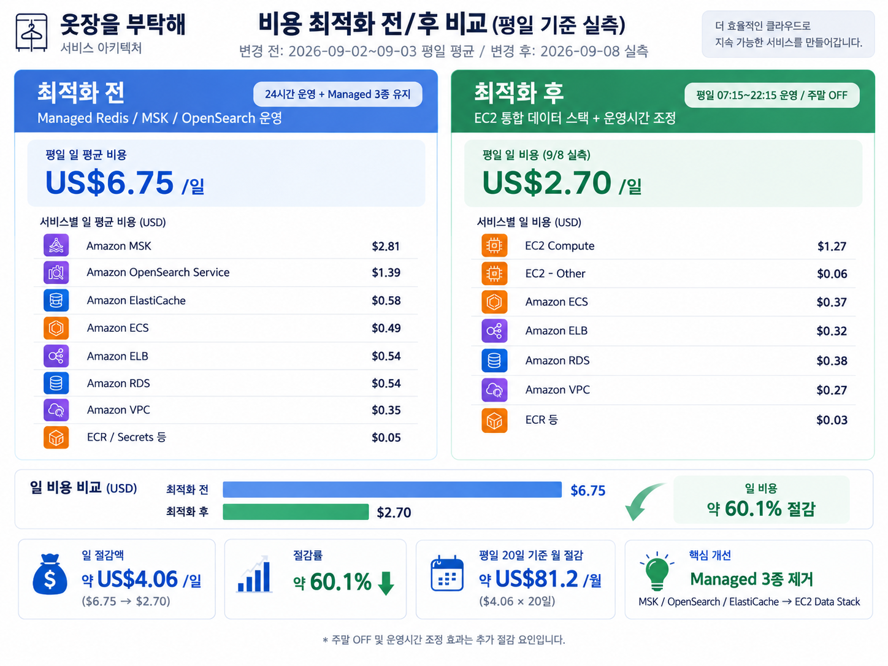

# 👕 옷장을 부탁해

> **오늘 뭐 입지?**  
> 고민은 짧게, 코디는 취향대로.

**옷장을 부탁해**는 사용자의 옷장과 취향, 현재 날씨를 바탕으로  
코디를 추천하고 OOTD를 공유할 수 있는 개인화 의상 추천 서비스입니다.

🌐 **Service:** https://otboo.work

---

## ✨ 주요 기능

- 🌤️ 현재 날씨와 취향을 반영한 코디 추천
- 👕 보유 의상 및 의상 속성 관리
- 👤 사용자 프로필과 패션 취향 관리
- 📸 OOTD 피드 등록 및 조회
- ❤️ 좋아요 · 댓글 · 팔로우
- 💬 실시간 DM
- 🔔 실시간 알림
- 🔎 피드 검색
- ⏰ 날씨 데이터 수집 및 배치 처리

---

## 🛠 Tech Stack

### Backend

`Java 17` · `Spring Boot 3.5.16` · `Gradle`  
`Spring MVC` · `Spring Security` · `Spring Data JPA`  
`Spring Batch` · `Spring Cache`

### Data & Messaging

`PostgreSQL 16` · `Redis 7.4`  
`Apache Kafka 3.9.2` · `OpenSearch 1.3.20`

### Realtime

`WebSocket / STOMP` · `SSE`

### Infra & DevOps

`Docker` · `Nginx` · `GitHub Actions`  
`AWS ECS Fargate` · `Amazon EC2` · `Amazon ECR` · `ALB`  
`Route 53` · `ACM` · `Amazon RDS` · `Amazon S3`  
`AWS Systems Manager` · `CloudWatch` · `SNS`

### Test

`JUnit 5` · `Mockito` · `Spring Boot Test`  
`Spring Security Test` · `Spring Batch Test` · `JaCoCo`

---

## 🏗 Architecture

### 현재 운영 아키텍처



> 초기에는 Amazon ElastiCache, Amazon MSK, Amazon OpenSearch Service를
> 운영 데이터 계층으로 구성했습니다.
>
> Issue #279에서는 저트래픽 포트폴리오·시연 환경의 비용을 줄이기 위해
> Redis, Kafka, OpenSearch를 하나의 EC2 Data Stack으로 통합했습니다.
> 기존 Managed 서비스는 전환 검증과 안정화 이후 제거했습니다.

### 구성 흐름

```text
Developer
   │
   ▼
GitHub PR
   │
   ├─ Build / Test
   └─ JaCoCo 80% Quality Gate
   │
   ▼
GitHub Actions
   │ OIDC
   ▼
Amazon ECR
   │
   ▼
ECS Fargate
┌─────────────────────────────┐
│ Nginx Sidecar :80           │
│          ↓                  │
│ Spring Boot :8080           │
│ + Frontend Static Resources │
└─────────────────────────────┘
   │
   ├─ RDS PostgreSQL
   ├─ Amazon S3
   └─ VPC Private IP
        │
        ▼
      EC2 Data Stack
        ├─ Redis 7.4 :6379
        ├─ Kafka 3.9.2 :9092
        └─ OpenSearch 1.3.20 :9200


Client
  │
  ▼
Route 53
  │
  ▼
ALB HTTPS / ACM
  │
  ▼
Nginx
  │
  ▼
Spring Boot
```

GitHub Actions는 OIDC로 AWS에 인증하고,  
Git Commit SHA 기반 Docker 이미지를 ECR에 저장한 뒤 ECS Fargate에 배포합니다.

운영 트래픽은 `otboo.work` → Route 53 → ALB HTTPS → Nginx → Spring Boot 순서로 전달됩니다.

Redis, Kafka, OpenSearch는 비용 최적화를 위해 단일 EC2 Data Stack으로 통합하고,
ECS에서는 동일 VPC의 Private IP를 통해 접근합니다.

> 인프라가 어떻게 여기까지 왔는지 궁금하다면 `docs/aws`에 꽤 많이 적혀 있습니다. ☁️

---

## 💰 Cost Optimization

Issue #279에서는 기존 Managed Redis / Kafka / OpenSearch 운영 구조를
EC2 통합 데이터 스택으로 전환하고, 운영 시간을 실제 사용 시간에 맞게 조정했습니다.



| 구분 | 변경 전 | 변경 후 |
| --- | ---: | ---: |
| 비교 기준 | 2026-09-02~09-03 평일 평균 | 2026-09-08 |
| 평일 일 비용 | 약 **US$6.75** | 약 **US$2.70** |
| 평일 일 절감액 | - | 약 **US$4.06** |
| 절감률 | - | 약 **60.1%** |
| 평일 20일 단순 환산 | - | 약 **US$81.2 /월 절감** |

주요 변경 사항:

- Amazon ElastiCache → EC2 Redis 7.4
- Amazon MSK Provisioned → EC2 Kafka 3.9.2 KRaft Single Broker
- Amazon OpenSearch Service → EC2 OpenSearch 1.3.20 Single Node
- 평일 `07:15` RDS / Data EC2 시작
- 평일 `07:45` ECS 시작
- 평일 `22:00` ECS → `22:10` Data EC2 → `22:15` RDS 순차 종료
- 주말 ECS / RDS / Data EC2 OFF
- EC2 Stop/Start 후 `systemd` 기반 데이터 스택 자동 복구 검증
- GitHub Actions 배포 전 SSM 기반 Data Stack Ready Gate 유지

> 비용 수치는 AWS Cost Explorer `UnblendedCost` 기준입니다.
> 조회 당시 일별 데이터는 `Estimated=true` 상태였으므로
> 청구 데이터 확정 과정에서 소폭 조정될 수 있습니다.
> 월 US$81.2는 평일 20일을 단순 환산한 예상 절감액이며 실제 월 청구액과는 다를 수 있습니다.

자세한 전환 과정, Rollback 기준, 보안·가용성 Trade-off는
[EC2 통합 데이터 스택 운영 문서](./docs/aws/data-stack/README.md)에서 확인할 수 있습니다.

---

## 🚀 Local Run

### 1. 환경변수 준비

```bash
cp .env.example .env
```

`.env.example`을 참고해 필요한 환경변수를 입력합니다.

### 2. PostgreSQL / Redis 실행

```bash
docker compose up -d
```

### 3. 애플리케이션 실행

```bash
./scripts/run-local.sh
```

### 4. 테스트

```bash
./gradlew clean test
```

### Swagger UI

```text
http://localhost:8080/swagger-ui/index.html
```

---

## 📚 Documentation

세부 구현과 운영 과정은 각 문서에서 확인할 수 있습니다.

| 영역 | 문서 |
| --- | --- |
| ☁️ AWS 운영 전반 | [docs/aws/README.md](./docs/aws/README.md) |
| 🚀 ECS / ALB / 배포 | [docs/aws/ecs-alb/README.md](./docs/aws/ecs-alb/README.md) |
| 📦 ECR | [docs/aws/ecr/README.md](./docs/aws/ecr/README.md) |
| 🗄️ RDS / S3 | [docs/aws/rds-s3/README.md](./docs/aws/rds-s3/README.md) |
| 🖥️ EC2 통합 데이터 스택 | [docs/aws/data-stack/README.md](./docs/aws/data-stack/README.md) |
| ⚡ ElastiCache 운영 이력 | [docs/aws/elasticache/README.md](./docs/aws/elasticache/README.md) |
| 📨 Amazon MSK 운영 이력 | [docs/aws/msk/README.md](./docs/aws/msk/README.md) |
| 🔎 OpenSearch 운영 이력 | [docs/aws/opensearch/README.md](./docs/aws/opensearch/README.md) |
| 📨 Kafka | [docs/kafka/README.md](./docs/kafka/README.md) |
| 💾 Storage | [docs/storage/README.md](./docs/storage/README.md) |
| 🧩 ERD | [docs/erd/README.md](./docs/erd/README.md) |

---

## 🔧 Engineering Highlights

- GitHub Actions **OIDC 기반 AWS 인증 및 자동 배포**
- Git Commit SHA 기반 **Immutable Docker Image**
- ECS Fargate **Rolling Update**
- ALB Health Check 기반 트래픽 전환
- Deployment Circuit Breaker 및 Rollback
- RDS 및 EC2 Data Stack과 **VPC Private Network 통신**

- Redis **AUTH + Security Group 기반 접근 제어**

- Kafka 3.9.2 **KRaft 단일 Broker 운영 및 Topic / DLT 구성**

- OpenSearch 1.3.20 **Single Node 검색 인프라 운영**

- ElastiCache / Amazon MSK / Amazon OpenSearch Service 구축 후
  **EC2 통합 데이터 스택으로 비용 최적화**

- EC2 재부팅 시 `systemd` 기반 **Redis / Kafka / OpenSearch 자동 복구**

- GitHub Actions + SSM 기반 **데이터 스택 Ready Gate**
- WebSocket / SSE 기반 실시간 통신
- CloudWatch / SNS 기반 운영 모니터링
- JaCoCo **Line Coverage 80% Quality Gate**

---

## 👥 Team

| 이름 | 담당 |
| --- | --- |
| 강우진 | 팀장 · 공통 개발 환경 · 인프라 |
| 김지혜 | 인증 · 인가 · 프로필 |
| 김관희 | 의상 관리 |
| 최정윤 | 날씨 · 배치 · 성능 |
| 정수용 | 댓글 · 좋아요 · 알림 · 소셜 기능 |

---

## 👋 마지막으로

옷은 많은데 입을 옷이 없을 때,

### **옷장을 부탁해 👕**