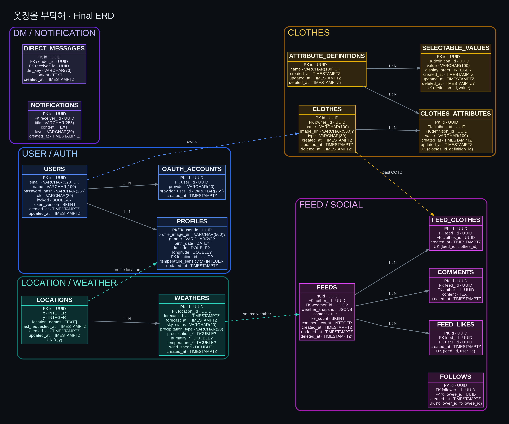

# 옷장을 부탁해 통합 ERD 

## 1. 사용자·인증 도메인

### `users`

| 컬럼 | 타입 | 제약 | 의미 |
|---|---|---|---|
| `id` | UUID | PK | 사용자 식별자 |
| `email` | VARCHAR(320) | NOT NULL, UNIQUE | 로그인 이메일 |
| `name` | VARCHAR(100) | NOT NULL | 사용자 이름 |
| `password_hash` | VARCHAR(255) | NOT NULL | 암호화된 비밀번호 |
| `role` | VARCHAR(20) | NOT NULL | `ADMIN`, `USER` |
| `locked` | BOOLEAN | NOT NULL, DEFAULT FALSE | 계정 잠금 여부 |
| `token_version` | BIGINT | NOT NULL, DEFAULT 0 | 권한 변경·계정 잠금 시 JWT 무효화 버전 |
| `created_at` | TIMESTAMPTZ | NOT NULL | 생성 시각 |
| `updated_at` | TIMESTAMPTZ | NOT NULL | 수정 시각 |

### `profiles`

| 컬럼 | 타입 | 제약 | 의미 |
|---|---|---|---|
| `user_id` | UUID | PK, FK → `users.id` | 프로필 소유 사용자 |
| `profile_image_url` | VARCHAR(500) | NULL | 프로필 이미지 URL |
| `gender` | VARCHAR(20) | NULL | Swagger Gender enum |
| `birth_date` | DATE | NULL | 생년월일 |
| `latitude` | DOUBLE PRECISION | NULL | 사용자가 설정한 위도 |
| `longitude` | DOUBLE PRECISION | NULL | 사용자가 설정한 경도 |
| `location_id` | UUID | FK → `locations.id`, NULL | 기상청 격자 위치 |
| `temperature_sensitivity` | INTEGER | NOT NULL | 온도 민감도 |
| `updated_at` | TIMESTAMPTZ | NOT NULL | 수정 시각 |

### `oauth_accounts`

| 컬럼 | 타입 | 제약 | 의미 |
|---|---|---|---|
| `id` | UUID | PK | OAuth 계정 식별자 |
| `user_id` | UUID | FK → `users.id`, NOT NULL | 연동 사용자 |
| `provider` | VARCHAR(20) | NOT NULL | OAuth 공급자 |
| `provider_user_id` | VARCHAR(255) | NOT NULL | 공급자 사용자 식별자 |
| `created_at` | TIMESTAMPTZ | NOT NULL | 연동 시각 |

---

## 2. 위치·날씨 도메인

### `locations`

| 컬럼 | 타입 | 제약 | 의미 |
|---|---|---|---|
| `id` | UUID | PK | 격자 위치 식별자 |
| `x` | INTEGER | NOT NULL | 기상청 격자 X |
| `y` | INTEGER | NOT NULL | 기상청 격자 Y |
| `location_names` | TEXT[] | NOT NULL, DEFAULT `'{}'` | 행정구역명 배열 |
| `last_requested_at` | TIMESTAMPTZ | NOT NULL | 마지막 요청 시각 |
| `created_at` | TIMESTAMPTZ | NOT NULL | 생성 시각 |
| `updated_at` | TIMESTAMPTZ | NOT NULL | 수정 시각 |

### `weathers`

| 컬럼 | 타입 | 제약 | 의미 |
|---|---|---|---|
| `id` | UUID | PK | 날씨 식별자 |
| `location_id` | UUID | FK → `locations.id`, NOT NULL | 예보 위치 |
| `forecasted_at` | TIMESTAMPTZ | NOT NULL | 기상청 예보 발표 시각 |
| `forecast_at` | TIMESTAMPTZ | NOT NULL | 예보 대상 시각 |
| `sky_status` | VARCHAR(20) | NOT NULL | 하늘 상태 |
| `precipitation_type` | VARCHAR(20) | NOT NULL | 강수 형태 |
| `precipitation_amount` | DOUBLE PRECISION | NULL | 강수량 |
| `precipitation_probability` | DOUBLE PRECISION | NULL | 강수 확률 |
| `humidity_current` | DOUBLE PRECISION | NULL | 현재 습도 |
| `humidity_compared_to_day_before` | DOUBLE PRECISION | NULL | 전일 대비 습도 |
| `temperature_current` | DOUBLE PRECISION | NULL | 현재 기온 |
| `temperature_compared_to_day_before` | DOUBLE PRECISION | NULL | 전일 대비 기온 |
| `temperature_min` | DOUBLE PRECISION | NULL | 최저 기온 |
| `temperature_max` | DOUBLE PRECISION | NULL | 최고 기온 |
| `wind_speed` | DOUBLE PRECISION | NULL | 풍속 |
| `created_at` | TIMESTAMPTZ | NOT NULL | 수집 시각 |

---

## 3. 의상 도메인

### `clothes`

| 컬럼 | 타입 | 제약 | 의미 |
|---|---|---|---|
| `id` | UUID | PK | 의상 식별자 |
| `owner_id` | UUID | FK → `users.id`, NOT NULL | 의상 소유 사용자 |
| `name` | VARCHAR(100) | NOT NULL | 의상 이름 |
| `image_url` | VARCHAR(500) | NULL | 의상 이미지 URL |
| `type` | VARCHAR(30) | NOT NULL | Swagger ClothesType enum |
| `created_at` | TIMESTAMPTZ | NOT NULL | 생성 시각 |
| `updated_at` | TIMESTAMPTZ | NOT NULL | 수정 시각 |
| `deleted_at` | TIMESTAMPTZ | NULL | 논리 삭제 시각 |

### `clothes_attribute_definitions`

| 컬럼 | 타입 | 제약 | 의미 |
|---|---|---|---|
| `id` | UUID | PK | 의상 속성 정의 식별자 |
| `name` | VARCHAR(100) | NOT NULL, UNIQUE | 속성 이름 |
| `created_at` | TIMESTAMPTZ | NOT NULL | 생성 시각 |
| `updated_at` | TIMESTAMPTZ | NOT NULL | 수정 시각 |
| `deleted_at` | TIMESTAMPTZ | NULL | 논리 삭제 시각 |

### `attribute_selectable_values`

| 컬럼 | 타입 | 제약 | 의미 |
|---|---|---|---|
| `id` | UUID | PK | 선택값 식별자 |
| `definition_id` | UUID | FK → `clothes_attribute_definitions.id`, NOT NULL | 속성 정의 |
| `value` | VARCHAR(100) | NOT NULL | 선택 가능한 문자열 |
| `display_order` | INTEGER | NOT NULL, DEFAULT 0 | 표시 순서 |
| `created_at` | TIMESTAMPTZ | NOT NULL | 생성 시각 |
| `updated_at` | TIMESTAMPTZ | NOT NULL | 수정 시각 |
| `deleted_at` | TIMESTAMPTZ | NULL | 논리 삭제 시각 |

### `clothes_attributes`

| 컬럼 | 타입 | 제약 | 의미 |
|---|---|---|---|
| `id` | UUID | PK | 의상 속성 식별자 |
| `clothes_id` | UUID | FK → `clothes.id`, NOT NULL | 대상 의상 |
| `definition_id` | UUID | FK → `clothes_attribute_definitions.id`, NOT NULL | 속성 정의 |
| `value` | VARCHAR(100) | NOT NULL | 의상에 저장된 속성값 |
| `created_at` | TIMESTAMPTZ | NOT NULL | 생성 시각 |
| `updated_at` | TIMESTAMPTZ | NOT NULL | 수정 시각 |

---

## 4. 피드·소셜 도메인

### `feeds`

| 컬럼 | 타입 | 제약 | 의미 |
|---|---|---|---|
| `id` | UUID | PK | 피드 식별자 |
| `author_id` | UUID | FK → `users.id`, NOT NULL | 작성자 |
| `weather_id` | UUID | FK → `weathers.id`, NULL | 원본 날씨 |
| `weather_snapshot` | JSONB | NOT NULL | 피드 작성 당시 날씨 정보 |
| `content` | TEXT | NOT NULL | 피드 본문 |
| `like_count` | BIGINT | NOT NULL, DEFAULT 0 | 좋아요 수 |
| `comment_count` | INTEGER | NOT NULL, DEFAULT 0 | 댓글 수 |
| `created_at` | TIMESTAMPTZ | NOT NULL | 생성 시각 |
| `updated_at` | TIMESTAMPTZ | NOT NULL | 수정 시각 |
| `deleted_at` | TIMESTAMPTZ | NULL | 논리 삭제 시각 |

### `feed_clothes`

| 컬럼 | 타입 | 제약 | 의미 |
|---|---|---|---|
| `id` | UUID | PK | 피드·의상 연결 식별자 |
| `feed_id` | UUID | FK → `feeds.id`, NOT NULL | 피드 |
| `clothes_id` | UUID | FK → `clothes.id`, NOT NULL | 의상 |
| `created_at` | TIMESTAMPTZ | NOT NULL | 연결 시각 |

### `feed_likes`

| 컬럼 | 타입 | 제약 | 의미 |
|---|---|---|---|
| `id` | UUID | PK | 좋아요 식별자 |
| `feed_id` | UUID | FK → `feeds.id`, NOT NULL | 대상 피드 |
| `user_id` | UUID | FK → `users.id`, NOT NULL | 좋아요 사용자 |
| `created_at` | TIMESTAMPTZ | NOT NULL | 좋아요 시각 |

### `comments`

| 컬럼 | 타입 | 제약 | 의미 |
|---|---|---|---|
| `id` | UUID | PK | 댓글 식별자 |
| `feed_id` | UUID | FK → `feeds.id`, NOT NULL | 대상 피드 |
| `author_id` | UUID | FK → `users.id`, NOT NULL | 댓글 작성자 |
| `content` | TEXT | NOT NULL | 댓글 내용 |
| `created_at` | TIMESTAMPTZ | NOT NULL | 생성 시각 |

### `follows`

| 컬럼 | 타입 | 제약 | 의미 |
|---|---|---|---|
| `id` | UUID | PK | 팔로우 식별자 |
| `follower_id` | UUID | FK → `users.id`, NOT NULL | 팔로우하는 사용자 |
| `followee_id` | UUID | FK → `users.id`, NOT NULL | 팔로우받는 사용자 |
| `created_at` | TIMESTAMPTZ | NOT NULL | 생성 시각 |

---

## 5. DM·알림 도메인

### `direct_messages`

| 컬럼 | 타입 | 제약 | 의미 |
|---|---|---|---|
| `id` | UUID | PK | DM 식별자 |
| `sender_id` | UUID | FK → `users.id`, NOT NULL | 발신자 |
| `receiver_id` | UUID | FK → `users.id`, NOT NULL | 수신자 |
| `dm_key` | VARCHAR(73) | NOT NULL | 두 사용자의 공통 대화 키 |
| `content` | TEXT | NOT NULL | 메시지 내용 |
| `created_at` | TIMESTAMPTZ | NOT NULL | 전송 시각 |

### `notifications`

| 컬럼 | 타입 | 제약 | 의미 |
|---|---|---|---|
| `id` | UUID | PK | 알림 식별자 |
| `receiver_id` | UUID | FK → `users.id`, NOT NULL | 알림 수신자 |
| `title` | VARCHAR(255) | NOT NULL | 알림 제목 |
| `content` | TEXT | NOT NULL | 알림 본문 |
| `level` | VARCHAR(20) | NOT NULL | `INFO`, `WARNING`, `ERROR` |
| `created_at` | TIMESTAMPTZ | NOT NULL | 생성 시각 |

---

## 6. 주요 유니크·체크 제약

| 테이블 | 제약 |
|---|---|
| `users` | `UNIQUE(email)` |
| `oauth_accounts` | `UNIQUE(provider, provider_user_id)` |
| `oauth_accounts` | `UNIQUE(user_id, provider)` |
| `locations` | `UNIQUE(x, y)` |
| `weathers` | `UNIQUE(location_id, forecast_at, forecasted_at)` |
| `attribute_selectable_values` | `UNIQUE(definition_id, value)` |
| `clothes_attributes` | `UNIQUE(clothes_id, definition_id)` |
| `feed_clothes` | `UNIQUE(feed_id, clothes_id)` |
| `feed_likes` | `UNIQUE(feed_id, user_id)` |
| `follows` | `UNIQUE(follower_id, followee_id)` |
| `follows` | `CHECK(follower_id <> followee_id)` |
| `direct_messages` | `CHECK(sender_id <> receiver_id)` |
| `feeds` | `CHECK(like_count >= 0)` |
| `feeds` | `CHECK(comment_count >= 0)` |

---

## 7. 주요 FK 삭제 정책

| FK | 삭제 정책 |
|---|---|
| 사용자 참조 FK | `ON DELETE RESTRICT` |
| `profiles.location_id` | `ON DELETE RESTRICT` |
| `weathers.location_id` | `ON DELETE RESTRICT` |
| `attribute_selectable_values.definition_id` | `ON DELETE CASCADE` |
| `clothes_attributes.clothes_id` | `ON DELETE CASCADE` |
| `clothes_attributes.definition_id` | `ON DELETE RESTRICT` |
| `feeds.weather_id` | `ON DELETE SET NULL` |
| `feed_clothes.feed_id` | `ON DELETE CASCADE` |
| `feed_clothes.clothes_id` | `ON DELETE RESTRICT` |
| `feed_likes.feed_id` | `ON DELETE CASCADE` |
| `comments.feed_id` | `ON DELETE CASCADE` |

---

## 8. 확장사항

현재 Swagger와 프로토타입에는 회원 탈퇴 및 사용자 삭제 기능이 없습니다. 향후 회원 탈퇴 API를 추가하면 `users.deleted_at`, 개인정보 익명화, 최종 물리 삭제 시점, 피드·댓글·DM의 작성자 보존 방식, 좋아요 보존 여부와 사용자 FK 정책을 함께 다시 설계해야 합니다.

댓글 삭제 API를 추가할 경우에는 댓글을 즉시 물리 삭제할지, `deleted_at`을 추가해 논리 삭제할지 결정해야 합니다.

운영 단계에서는 `feeds.like_count`, `feeds.comment_count`와 실제 좋아요·댓글 행 개수를 비교하는 정합성 보정 배치를 추가할 수 있습니다.

과거 피드의 의상 정보를 작성 당시 상태로 완전히 고정해야 한다면 `feed_clothes`에 의상 스냅샷을 저장하는 구조를 추가로 검토할 수 있습니다.
